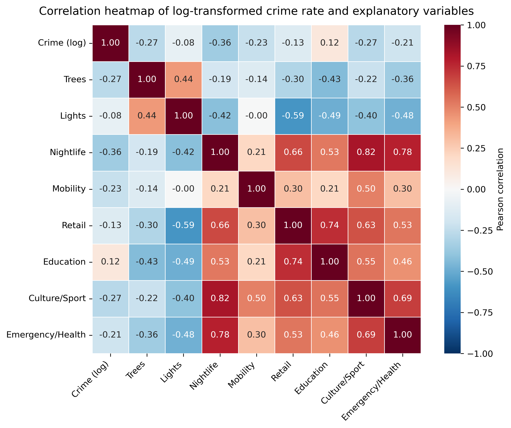

# Spatial Data Science Project

## Urban Design and Crime Exposure in Amsterdam

This repository presents a spatial data science project on how neighborhood-level crime in Amsterdam is distributed across space and how built-environment features help explain those patterns.

The project combines data preparation, exploratory spatial data analysis, mapping, and a regularized regression model. The curated repo is organized so GitHub readers can quickly find the final analysis notebooks, the supporting datasets, and the archived exploratory work.

## Research Question

How is neighborhood crime spatially clustered in Amsterdam, and how well can environmental design features such as tree density, streetlight density, and distance to facilities predict neighborhood crime rates?

## Methods

- Data cleaning and neighborhood-level feature construction
- Choropleth mapping of neighborhood crime rates
- Spatial autocorrelation analysis with Moran's I and LISA
- Ridge regression for correlated spatial predictors

## Recommended Reading Path

Start with the curated notebooks in [`notebooks/01_core/`](notebooks/01_core/):

1. [`01_build-analysis-dataset.ipynb`](notebooks/01_core/01_build-analysis-dataset.ipynb) builds the final neighborhood analysis table from the intermediate project datasets.
2. [`02_crime-choropleth.ipynb`](notebooks/01_core/02_crime-choropleth.ipynb) maps crime rates across Amsterdam neighborhoods.
3. [`03_spatial-autocorrelation.ipynb`](notebooks/01_core/03_spatial-autocorrelation.ipynb) evaluates spatial clustering using global and local autocorrelation.
4. [`04_ridge-model.ipynb`](notebooks/01_core/04_ridge-model.ipynb) fits the predictive model and interprets the coefficients.

Earlier exploratory work is preserved in [`notebooks/99_archive/`](notebooks/99_archive/).

## Repository Layout

```text
.
├── data/
│   ├── raw/
│   ├── intermediate/
│   ├── final/
│   └── archive/
├── docs/
│   ├── data-catalog.md
│   └── figures/
├── notebooks/
│   ├── 01_core/
│   ├── 99_archive/
│   └── README.md
├── requirements.txt
└── README.md
```

## Data Layout

- [`data/raw/`](data/raw/) contains source files used to construct the analysis data.
- [`data/intermediate/`](data/intermediate/) contains merged and aggregated project tables.
- [`data/final/`](data/final/) contains the final modeling dataset.
- [`data/archive/`](data/archive/) contains superseded or ambiguous historical artifacts retained for provenance.

Dataset details are documented in [`docs/data-catalog.md`](docs/data-catalog.md).

## Reproduction

Create a Python environment and install the project dependencies:

```bash
python -m venv .venv
source .venv/bin/activate
pip install -r requirements.txt
```

Then open the notebooks in [`notebooks/01_core/`](notebooks/01_core/) and run them in sequence.

## Example Output


